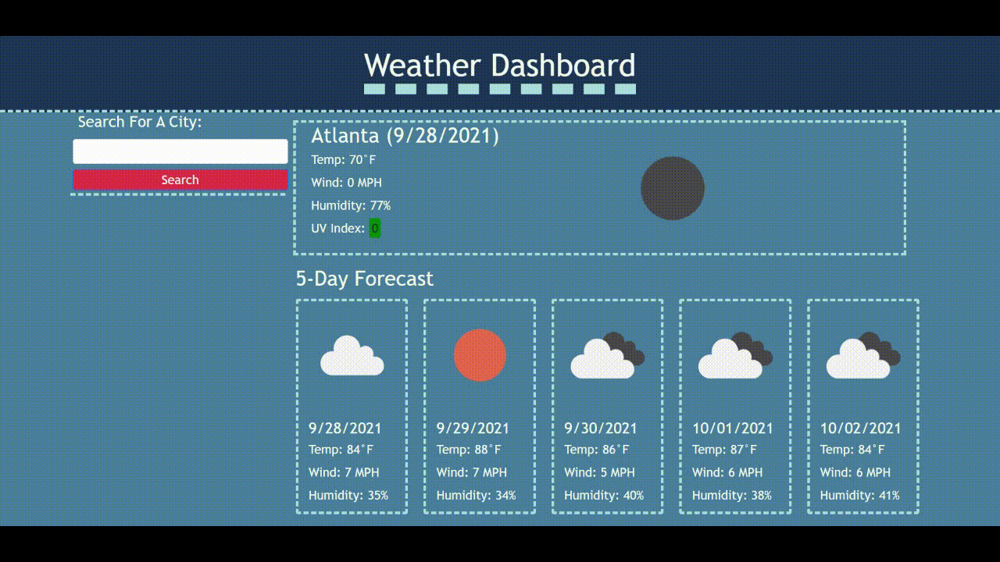

# Weather Dashboard

## Site Description
Enter a city to find out the current weather and the 5 day forecast. Your city searches are saved in a list below the search button. When you click a saved city, it brings up the current weather of that city and moves it to the top of the list. When you leave and come back to the site, the current weather from the last city you searched will automatically load.

##Mock-up
The animation below shows the saved city list functionality.

[Check the weather](https://brouiller.github.io/weather-dashboard/)
